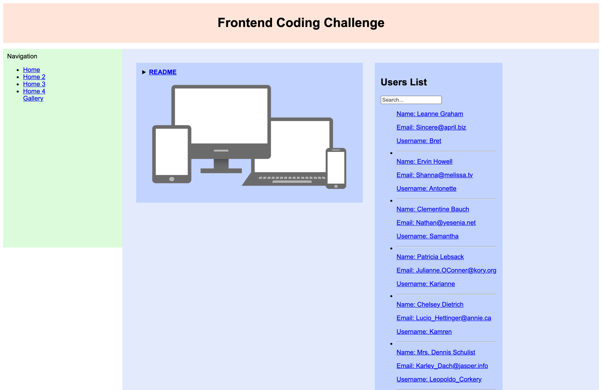
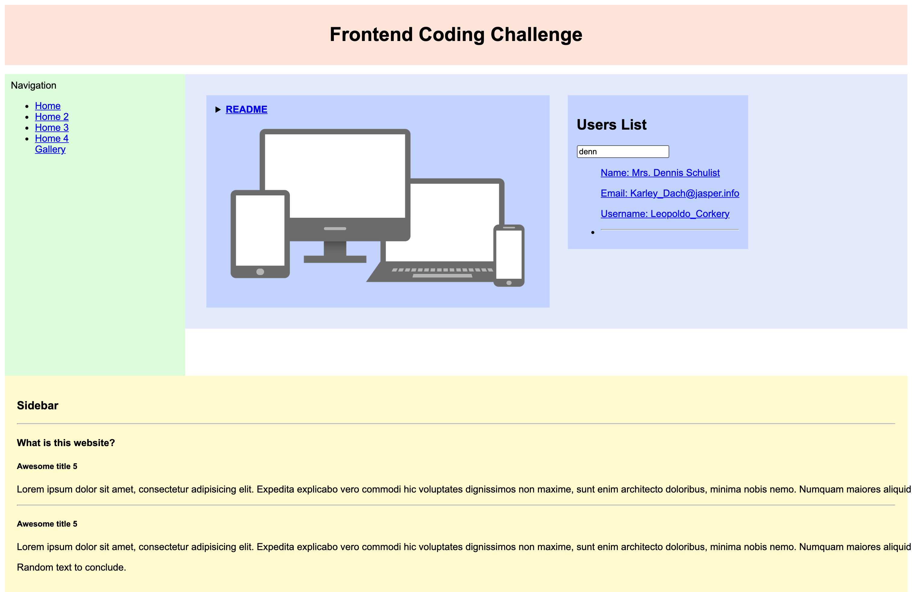
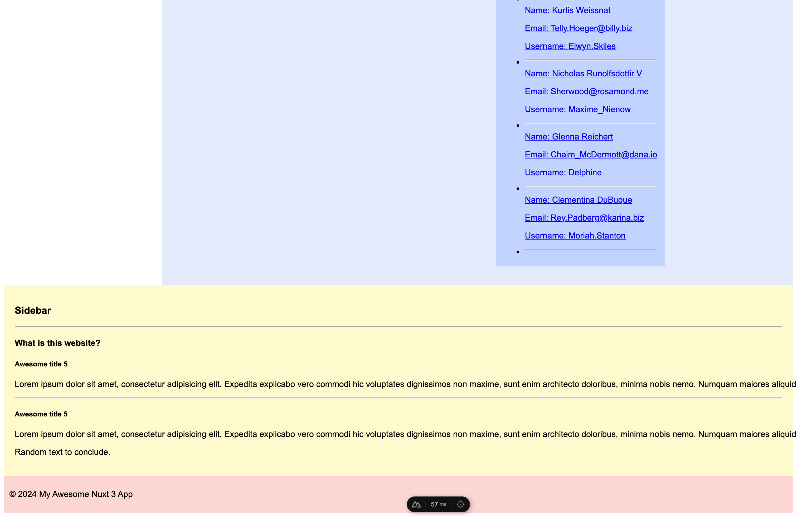
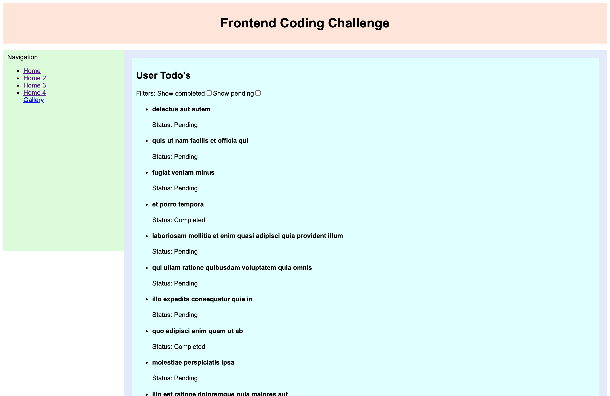
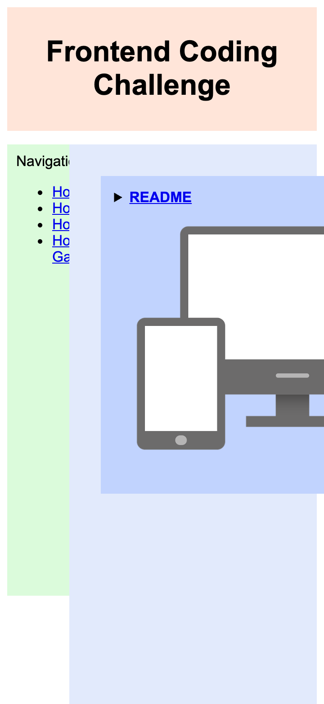

# Frontend Coding Challenge

This project is a basic Nuxt 3 (https://nuxt.com/docs/getting-started/introduction) app which uses some free API data to fetch a list of users and display their information in a list.

By clicking on one of the elements in the list, you are redirected to the user's profile, which contains the user's todo list.

## Goal

Please take no more than ~2 hours for this task. We are aware of everyone’s time limitations and appreciate you taking time to complete this challenge.
Let us know if you have any questions. We’d prefer to talk about a problem first before investing too much time into the wrong solution. We are happy to help!

The goal of the exercise is not to search or implement the perfect solution but rather to discuss the pros and cons of the different approaches on the different tasks. Try to focus on providing a working solution.

There are no right or wrong answers.

Feel free to ask any questions if anything is not clear!

## 1. Responsiveness

Change the current layout to bring some responsive behaviour.
Only implement a single solution, but try to think of different solutions that could be used to achieve responsiveness.

This will be discussed during the interview.

> Responsive web design makes your web page look good on all devices.

[W3Schools](https://www.w3schools.com/css/css_rwd_intro.asp)

> [!TIP]
> :art: **(Extra Bonus)** Do not use media queries.

## 2. To-do list

Navigate to the `/user/[id]` page that fetch user's to-do list.
Implement a few quick improvements that could be done to this page from your perspective. This could include any fields or changes.

Few examples:

- Filters to show or sort tasks based on their statuses (completed or pending).
- Filters to set the limit of displayed tasks.
- Actions to check/uncheck (all?) To-do items dynamically.

> [!TIP]
> :art: **(Extra Bonus)** Do not use JavaScript.

## 3. Page loading performance

Navigate to the `/gallery` page which contains a list of photos and some user statistics. This page is meant to be publicly accessible.

- What would be your 2-3 recommendations or approaches to guide a small team of developers to improve the loading performance of the Gallery page?
  <br/> Try to suggest something that the team can easily align on and let them find their own solutions to implement it.
  <br/> Optionally, include a brief code draft or example to illustrate how to begin applying your recommendation.

## 4. Architecture

The Gallery currently fetches its data from `/api/gallery`, using a [Nuxt server route](https://nuxt.com/docs/guide/directory-structure/server#api-routes) which acts as a minimal Backend-for-Frontend (BFF).

Improve the current implementation - but focus on making a decision for a quick first iteration.
You can choose one of the following approach as example:

- Continue with the current setup (BFF)
- Move the all logic into the client-side
- Use a static site generation (SSG) approach
- Any other approach that can simplify or quickly optimize the current implementation

**(Bonus)** Could Nuxt be used as a full backend? In what scenarios would that make sense, and what might be the limitations?

## Testing

Implement tests for the gallery and the todo list components

## (Bonus) Accessibility

What can you say regarding the actual accessibility of the website?
Where would you start if you were to improve it? You can present a rough plan of action or a few code examples.

## Setup

Please fork this repository into a public one, work in that one and provide us the GitHub link to it.

Install the dependencies:

```bash
# npm or pnpm or yarn or
npm install

# pnpm
pnpm install

# yarn
yarn install

# bun
bun install
```

Start the development server on `http://localhost:3000`:

```bash
# npm
npm run dev

# pnpm
pnpm run dev

# yarn
yarn dev

# bun
bun run dev
```

## Initial views

### Home



### Filter on User List



### Footer



### User Profile



---

### Mobile

<p>
  
</p>
